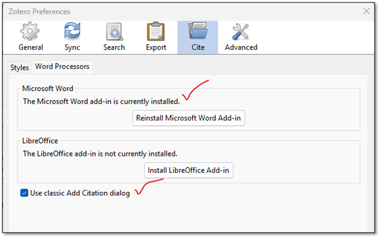
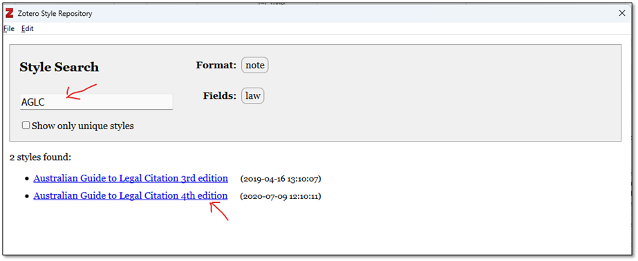

    

# Zotero AGLC4 Quick Reference

## Introduction
This document is a quick reference for installing and using Zotero for citing legal documents in Australia using the Australian Guide to Legal Citation 4th Edition.

This document is a companion to [this YouTube video](https://youtu.be/qd13d27LLCw). Most of the examples in the video are in the quick reference part of this document below.

For any questions please contact [Mark Ferraretto](https://people.flinders.edu.au/mark.ferraretto).

## Install Zotero
Zotero can be run from any Windows, MacOS or Linux computer. There are also iPad and iPhone Zotero apps. These apps are not covered in this document.

* Download from https://zotero.org
* Run the executable.
* Start Zotero

### Configure the installation
* Go to Edit -> Preferences -> Cite -> Word Processors
* Make sure the Word add-in is installed and that the classic add citation dialog is selected

    

### Add AGLC4 Style to Zotero
AGLC is not included with Zotero by default. It needs to be downloaded from the internet
* Go to Edit -> Preferences -> Cite -> Styles
* Click on ‘Get additional styles…’

    

* Enter ‘AGLC’ in the search box
* Select ‘Australian Guide to Legal Citation 4th Edition’

    

## Citing Sources
Below are examples of common sources cited by students in academic papers.

What|Example|Add to Zotero
---|---|---
**Reported cases**|*Commercial Bank of Australia v Amadio* (1983) 151 CLR 447|
**Medium-neutral citations**|*Delaforce v Simpson-Cook* [2010] NSWCA 84|
**Case with a short name**|*Commonwealth v Tasmania* (1983) 158 CLR 1 ('*Tasmanian Dams Case*')|
**Act**|*Fences Act 1936* (SA)|
**Bill**|Aged Care Bill 2024 (Cth)|
**Book**|George Williams, Sean Brennan and Andrew Lynch, *Blackshield and Williams: Australian Constitutional Law and Theory* (Federation Press, 7th ed, 2018)|
**Journal Article**|Michelle Evans, ‘Rethinking the Federal Balance: How Federal Theory Supports States’ Rights’ (2010) 1 *The Western Australian Jurist* 14.|
**Web Page**|‘Vanuatu Concerned about Food Supply in the Wake of Cyclone Pam’ (18 March 2015) <http://www.abc.net.au/am/content/2015/s4199741.htm>.|
**Legal Encyclopaedia Article**|LexisNexis Butterworths, *Halsbury’s Laws of Australia* (at 28 November 2011) ‘General Nature and Principles of Estoppel’ [190-5].|
